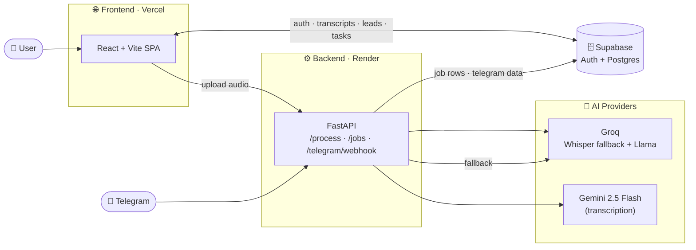

<div align="center">

# 🎙️ Audio Transcriber & Summariser

**Upload a call or voice note — get an accurate transcript, a clean summary, and the key points. In seconds.**

Powered by Google Gemini + Groq, with a Telegram bot and an evolving **SalesCall AI** layer for lead, task, and KPI tracking.

<br />

[](https://react.dev)
[](https://vitejs.dev)
[](https://tailwindcss.com)
[](https://fastapi.tiangolo.com)
[](https://www.python.org)
[](https://supabase.com)
[](https://ai.google.dev)
[](https://groq.com)

[](https://audio-transcriber-summariser.vercel.app)
[](https://audio-transcriber-summariser.onrender.com)

### [🔗 Live Demo](https://audio-transcriber-summariser.vercel.app)

</div>

<br />

<!--
  📸 SCREENSHOT / DEMO
  Drop a demo GIF or dashboard screenshot at docs/demo.gif (or docs/screenshot-dashboard.png)
  and it will render below. Recommended: a short GIF of upload → transcript → summary → PDF.
-->
<div align="center">
  
  <br />
  <sub><i>Replace <code>docs/demo.gif</code> with a real screenshot or demo recording.</i></sub>
</div>

---

## ✨ Overview

Sign in with Google, upload an audio file (MP3 / WAV / M4A), and the app returns a **full transcript**, a **concise summary**, and a list of **key points** — all downloadable as a PDF and saved to your personal **History**. You can also send audio through an integrated **Telegram bot**, which runs the exact same pipeline.

The project is expanding into **SalesCall AI**: call transcripts are analysed to automatically generate **leads, tasks, and KPIs** — turning raw conversations into a lightweight sales workflow.

---

## 🚀 Features

| | Feature |
|---|---|
| 🔐 | **Google OAuth** sign-in via Supabase |
| 🎧 | **Multi-format upload** — MP3, WAV, M4A |
| 📝 | **Transcription** by Gemini 2.5 Flash, with automatic **Groq Whisper fallback** |
| 🧠 | **AI summary + key points** via Groq Llama 3.3 70B |
| 📄 | **One-click PDF export** (generated client-side with jsPDF) |
| 🗂️ | **Persistent History** of every transcript, per user |
| ⚙️ | **Async job processing** with database-backed job rows |
| 🤖 | **Telegram bot** — upload audio and get results in chat, plus ask/translate/email/calendar actions |
| 📅 | **Daily digests** delivered over Telegram |
| 📈 | **SalesCall AI** — auto-generated leads, tasks, and KPIs from call analysis |

---

## 🧱 Tech Stack

| Layer | Technology |
|---|---|
| **Frontend** | React 18.3, Vite 5, Tailwind CSS 3, React Router 6 — deployed on **Vercel** |
| **Backend** | FastAPI 0.115 (Python 3.11), Uvicorn — deployed on **Render** |
| **Transcription** | Google Gemini 2.5 Flash *(primary)* → Groq Whisper `whisper-large-v3` *(fallback)* |
| **Summarisation / Reasoning** | Groq Llama 3.3 70B (`llama-3.3-70b-versatile`) |
| **Auth & Database** | Supabase (Google OAuth + PostgreSQL) |
| **Async jobs** | FastAPI BackgroundTasks + Supabase job rows |
| **PDF** | jsPDF 4 (client-side) |
| **Bot** | Telegram bot via backend webhook |

---

## 🏗️ Architecture



**Key design decisions**

- **Single combined endpoint** — `POST /process` receives the file, transcribes, summarises, and returns the result in one call (simpler than separate upload/transcribe/summarise routes).
- **No user auth headers to the backend** — the browser never sends an `Authorization: Bearer` token cross-origin (it triggered a Chrome/Brave permission popup). The backend authenticates to Supabase with its own key.
- **Dual-side database writes** — the browser writes transcripts/leads/tasks directly via the Supabase JS client; the backend writes independently for async jobs and the Telegram flow (which have no browser session).
- **Async jobs with a DB source of truth** — `POST /jobs` persists a Supabase job row and runs the pipeline in a BackgroundTask, so progress survives server restarts.
- **CORS is an explicit allowlist** — the Vercel domain + localhost + `ALLOWED_ORIGINS`, with credentials — not a wildcard.

---

## 📂 Project Structure

```
audio-transcriber-summariser/
├── backend/                     # FastAPI app (Python 3.11)
│   ├── main.py                  # App, CORS, route registration
│   ├── routes/
│   │   ├── process.py           # process_audio_file pipeline + POST /process
│   │   ├── jobs.py              # Async processing + DB job rows
│   │   ├── telegram.py          # Telegram webhook (reuses the pipeline)
│   │   ├── cron.py              # Daily Telegram digests
│   │   └── chat.py · analysis.py · admin.py · activity.py
│   ├── services/
│   │   ├── gemini_service.py    # Primary transcription
│   │   ├── groq_service.py      # Whisper fallback + Llama summarise/reason
│   │   ├── supabase_service.py  # Backend DB writes
│   │   └── telegram_service.py · digest_service.py · actions_service.py …
│   ├── models/schemas.py
│   └── requirements.txt
│
└── frontend/                    # React + Vite SPA
    └── src/
        ├── pages/               # LoginPage · Dashboard · HistoryPage
        ├── components/          # AudioUploader · TranscriptBox · SummaryBox …
        ├── services/            # supabase.js (client) · api.js (backend calls)
        └── utils/               # downloadPDF.js · copyText.js
```

---

## ⚡ Getting Started

### Prerequisites
- **Node.js** 18+
- **Python** 3.11
- **Supabase** project (Google OAuth enabled), plus **Gemini** and **Groq** API keys

### 1. Backend

```bash
cd backend

# Create & activate a virtual environment
python -m venv venv
source venv/bin/activate          # macOS/Linux
# .\venv\Scripts\Activate.ps1     # Windows PowerShell

pip install -r requirements.txt

# Create backend/.env (see Environment Variables below), then:
uvicorn main:app --reload         # → http://localhost:8000
```

### 2. Frontend

```bash
cd frontend

npm install

# Create frontend/.env (see Environment Variables below), then:
npm run dev                       # → http://localhost:5173
```

---

## 🔑 Environment Variables

> ⚠️ **Never commit real keys.** `.env` files are gitignored. The values below are descriptions only.

### Backend (`backend/.env` — set on Render in production)

| Variable | Purpose |
|---|---|
| `GEMINI_API_KEY` | Primary transcription (Gemini) |
| `GROQ_API_KEY` | Whisper fallback + Llama summarisation |
| `SUPABASE_URL` | Supabase project URL |
| `SUPABASE_KEY` | Supabase **anon** key (JWT format) |
| `SUPABASE_SERVICE_ROLE_KEY` | Service-role key for RLS-protected writes |
| `ALLOWED_ORIGINS` | Extra CORS origins, merged with the built-in allowlist |
| `TELEGRAM_BOT_TOKEN` | Telegram bot *(optional)* |
| `CRON_SECRET` | Guards the `/cron/digest` endpoint |
| `RESEND_API_KEY` / `EMAIL_FROM` | Telegram email action *(optional)* |

### Frontend (`frontend/.env` — set on Vercel in production)

| Variable | Purpose |
|---|---|
| `VITE_SUPABASE_URL` | Supabase project URL |
| `VITE_SUPABASE_ANON_KEY` | Supabase publishable/anon key |
| `VITE_BACKEND_URL` | Base URL of the FastAPI backend |

---

## 🔄 How It Works

1. **Upload** — the user selects an audio file (or sends one to the Telegram bot).
2. **Transcribe** — Gemini 2.5 Flash produces the transcript; if it fails, the pipeline falls back to Groq's `whisper-large-v3`.
3. **Summarise** — Groq Llama 3.3 70B generates a concise summary and key points.
4. **Return & persist** — results are returned to the client and saved to Supabase.
5. **Export & revisit** — download a PDF (client-side) or open past results from **History**.

---

## 🤖 Telegram Bot

Send audio to the bot and it runs the **same** `process_audio_file` pipeline. Each chat maps to a deterministic UUIDv5 user ID, so Telegram uploads land in their own History bucket. Supported in-chat actions include **PDF export, email, ask, translate, and calendar**, and a **daily digest** driven by the `/cron/digest` endpoint.

---

## 📈 SalesCall AI

Call transcripts feed an analysis pass that creates `leads`, `call_analyses`, and `sales_tasks` records. The frontend surfaces **leads, tasks, and KPIs** under `/sales-assistant/*`, turning conversations into an actionable sales workflow. CRUD is handled browser-side through the Supabase client.

---

## 🗺️ Roadmap & Notes

- ⏱️ **Keep-alive for the Render free tier** — the backend sleeps after ~15 min idle; a cron ping to `/ping` every ~10 min keeps the first request fast.
- 💳 **Credit accounting for Telegram** — credits are currently deducted client-side, so Telegram uploads bill 0; unify billing across surfaces.
- 🧪 **Broaden provider coverage** — `assemblyai_service.py` exists but is not yet wired into the live pipeline (Gemini + Groq only today).

---

<div align="center">

**Built with ❤️ using React, FastAPI, Gemini & Groq**

[🔗 Live Demo](https://audio-transcriber-summariser.vercel.app) · [Frontend](https://audio-transcriber-summariser.vercel.app) · [Backend API](https://audio-transcriber-summariser.onrender.com)

</div>
